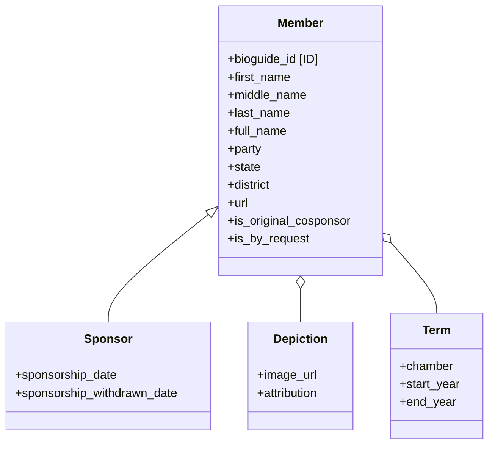
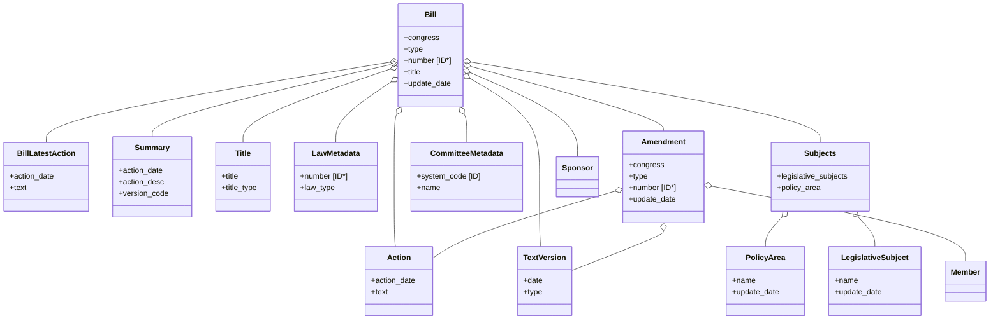
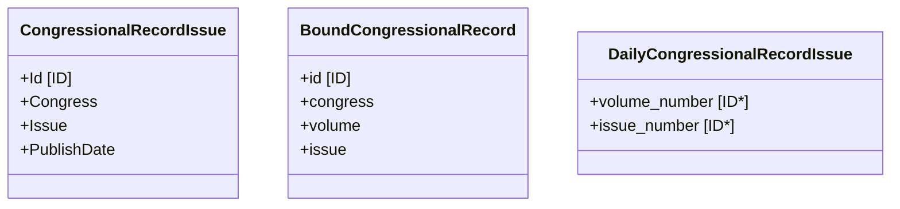
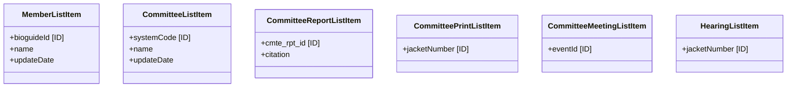
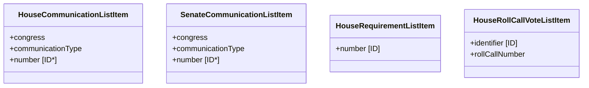
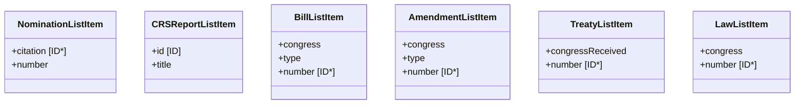

# Data Structures Overview

This diagram summarizes the core data models, their relationships, and the field(s) used as unique identifiers where applicable. Composite IDs are noted when a single field is not sufficient.

## Using the Client

The project wraps the Congress.gov API in `CDGClient` (see src/data_collection/client.py). The client reads the API key from `CONGRESS_API_KEY` or you can pass it directly.

```python
from src.data_collection.client import CDGClient

client = CDGClient(api_key="YOUR_API_KEY")
response = client.get("member", params={"limit": 5})
print(response["members"][0])
```

## Using Endpoint Helpers

Endpoint modules live under src/data_collection/endpoints and provide convenience helpers that return parsed response dictionaries or aggregated lists.

```python
from src.data_collection.client import CDGClient
from src.data_collection.endpoints.member import get_members_list, gather_members

client = CDGClient(api_key="YOUR_API_KEY")

# raw paginated response
page = get_members_list(client, offset=0, pageSize=250)

# aggregated results for non-paginated endpoints
members = gather_members(client)
```

For paginated endpoints that expose list-level results, use the shared pagination helpers in src/data_collection/utils.py. They accept a page-fetcher and the response list key from `CongressDataType` in src/data_collection/data_types.py.

```python
from src.data_collection.client import CDGClient
from src.data_collection.utils import gather_paginated_metadata
from src.data_collection.data_types import CongressDataType
from src.data_collection.endpoints.bill import get_bills_metadata

client = CDGClient(api_key="YOUR_API_KEY")

all_bills = gather_paginated_metadata(
  lambda offset, page_size: get_bills_metadata(client, offset=offset, pageSize=page_size),
  data_key=CongressDataType.BILLS,
  desc="Bills",
  unit="bill",
)
```

## Data Collection Orchestration

Use src/data_collection/collector.py to orchestrate two-step data collection:
1) fetch list-level records from paginated endpoints, and
2) enrich each record with detail data, while saving progress for resumable runs.

```python
from pathlib import Path

from src.data_collection.client import CDGClient
from src.data_collection.collector import collect_with_details
from src.data_collection.data_types import CongressDataType
from src.data_collection.endpoints.bill import get_bills_metadata

client = CDGClient(api_key="YOUR_API_KEY")

def list_fetcher(offset: int, page_size: int) -> dict:
  return get_bills_metadata(client, offset=offset, pageSize=page_size)

def id_getter(item: dict) -> str:
  return f"{item.get('congress')}-{item.get('type')}-{item.get('number')}"

def detail_fetcher(item: dict) -> dict:
  congress = item["congress"]
  bill_type = item["type"].lower()
  number = item["number"]
  return client.get(f"bill/{congress}/{bill_type}/{number}")["bill"]

results = collect_with_details(
  fetch_page=list_fetcher,
  data_key=CongressDataType.BILLS,
  detail_fetcher=detail_fetcher,
  id_getter=id_getter,
  list_checkpoint=Path("checkpoints/bills_list.json"),
  list_results=Path("checkpoints/bills_list_results.json"),
  detail_checkpoint=Path("checkpoints/bills_detail.json"),
  detail_results=Path("checkpoints/bills_detail_results.json"),
)
```

This pattern is intended for scheduled, incremental collection (e.g., daily runs). The
checkpoint files allow the job to resume without duplicating previously collected data.

## Streamlit App

The Streamlit app now lives under app/. Launch it from the repository root with:

```
streamlit run app/dashboard.py
```

Additional Streamlit pages are located in app/pages.

## Documentation Index

- [AmendmentEndpoint.md](AmendmentEndpoint.md)
- [BillEndpoint.md](BillEndpoint.md)
- [BoundCongressionalRecordEndpoint.md](BoundCongressionalRecordEndpoint.md)
- [CommitteeEndpoint.md](CommitteeEndpoint.md)
- [CommitteeMeetingEndpoint.md](CommitteeMeetingEndpoint.md)
- [CommitteePrintEndpoint.md](CommitteePrintEndpoint.md)
- [CommitteeReportEndpoint.md](CommitteeReportEndpoint.md)
- [CongressEndpoint.md](CongressEndpoint.md)
- [CRSReportEndpoint.md](CRSReportEndpoint.md)
- [DailyCongressionalRecordEndpoint.md](DailyCongressionalRecordEndpoint.md)
- [HearingEndpoint.md](HearingEndpoint.md)
- [HouseCommunicationEndpoint.md](HouseCommunicationEndpoint.md)
- [HouseRequirementEndpoint.md](HouseRequirementEndpoint.md)
- [HouseRollCallVoteEndpoint.md](HouseRollCallVoteEndpoint.md)
- [MemberEndpoint.md](MemberEndpoint.md)
- [NominationEndpoint.md](NominationEndpoint.md)
- [SenateCommunicationEndpoint.md](SenateCommunicationEndpoint.md)
- [SummariesEndpoint.md](SummariesEndpoint.md)
- [TreatyEndpoint.md](TreatyEndpoint.md)

## People & Identity



## Bills & Amendments



## Congressional Records



## List-level API Items (1/3)



## List-level API Items (2/3)



## List-level API Items (3/3)



## ID Notes
- **Bills**: typically identified by `(congress, type, number)`.
- **Amendments**: typically identified by `(congress, type, number)`.
- **Treaties**: typically identified by `(congressReceived, number, suffix)`.
- **House/Senate communications**: often `(congress, communicationType.code, number)`.
